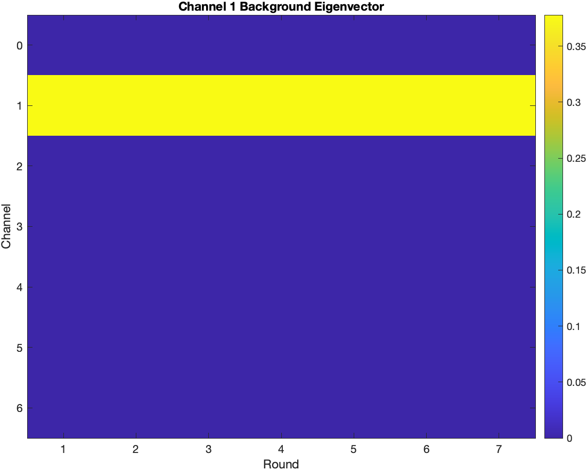
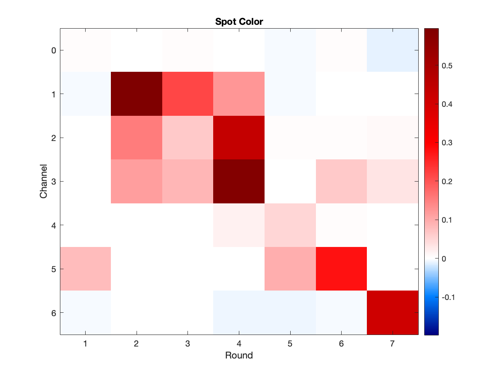
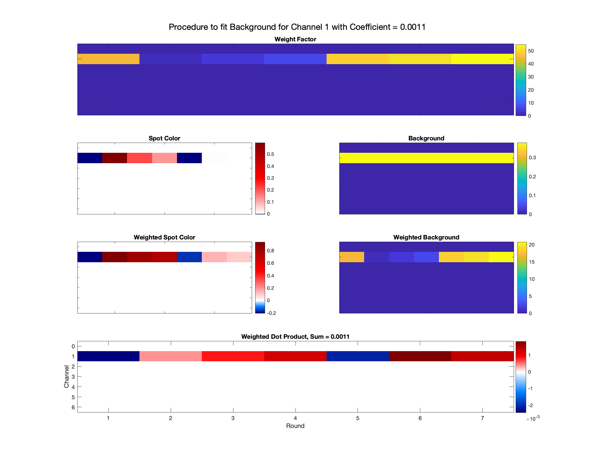
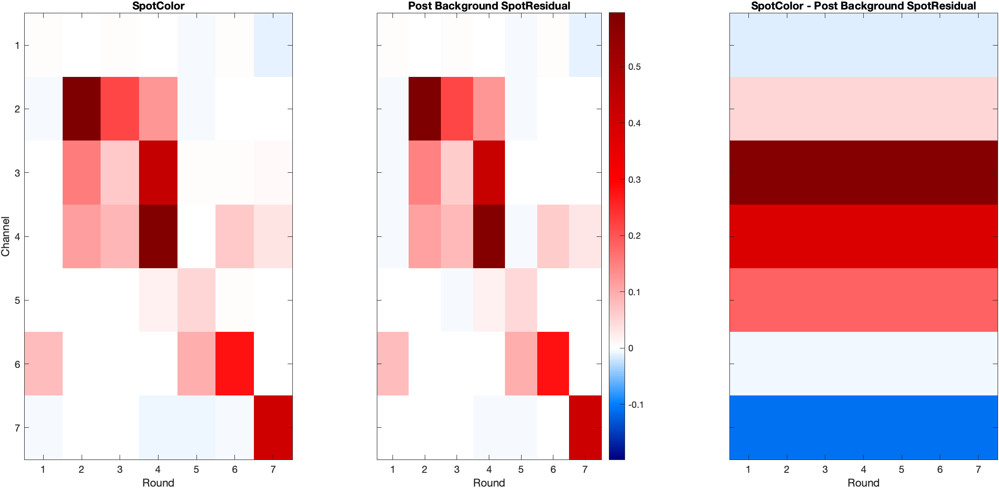
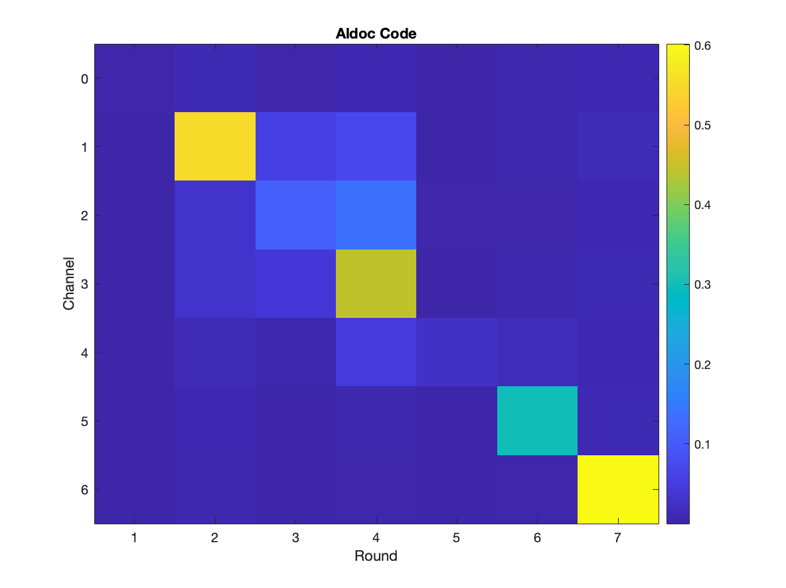
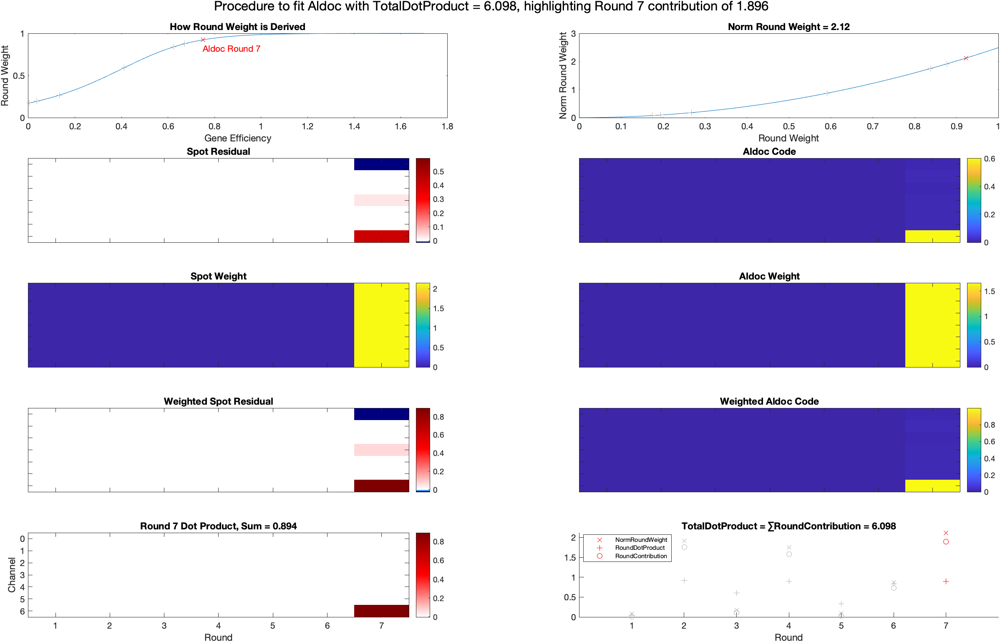
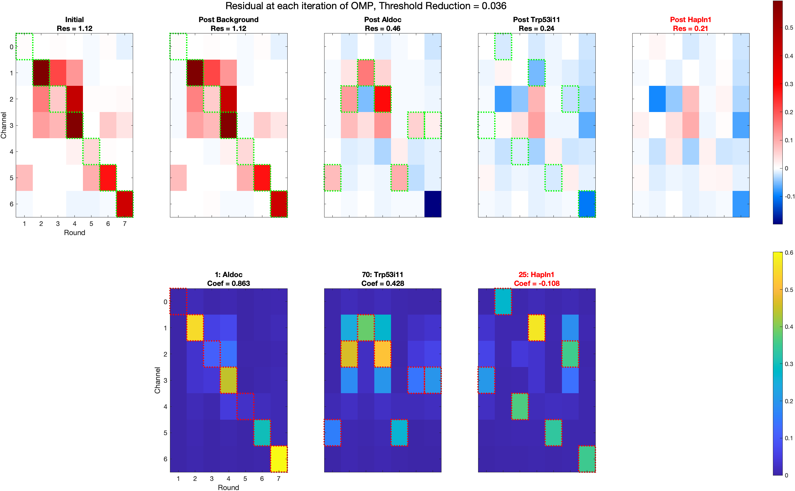

# Orthogonal Matching Pursuit Method
The orthogonal matching pursuit (OMP) algorithm used in [this folder](https://github.com/jduffield65/iss/tree/master/%40iss_OMP_ConstantBackground_WeightDotProduct) differs from the [conventional algorithm](https://github.com/jduffield65/iss/blob/6b5cd2336e56ad844be8fe54cc36c38f8e0deba3/omp_free_background.m) in how the background is fitted and how the next atom (gene in this case) is selected. This document expalins how.

The function that carries out the OMP is [```o.get_omp_coefs```](https://github.com/jduffield65/iss/blob/6b5cd2336e56ad844be8fe54cc36c38f8e0deba3/@iss_OMP_ConstantBackground_WeightDotProduct/get_omp_coefs.m). It takes SpotColors [normalised by channel](https://github.com/jduffield65/iss/blob/6b5cd2336e56ad844be8fe54cc36c38f8e0deba3/@iss_Base/get_channel_norm.m) and fits the [background eigenvectors](https://github.com/jduffield65/iss/blob/6b5cd2336e56ad844be8fe54cc36c38f8e0deba3/@iss_OMP/get_background_codes.m) followed by successive genes, as long as they exceed a certain threshold.

## Fitting Background
The background is fitted using the function [```o.get_spot_residual_background```](https://github.com/jduffield65/iss/blob/6b5cd2336e56ad844be8fe54cc36c38f8e0deba3/@iss_OMP_ConstantBackground_WeightDotProduct/get_spot_residual_background.m). This assumes that there are ```o.nBP``` background eigenvectors and each one is just a strip in a color channel i.e. ```o.ompBackgroundChannelStrips=true```. An example for channel 1 is shown below:

<p float="left">
 
</p>

The background fitting procedure will be illustrated by fitting the above background vector to the following (channel normalised) spot color:

<p float="left">
 
</p>

The basic procedure, shown below, is to find a weight factor that normalises the contribution from each round so that no one round dominates. Multiply both background code and spot color by this weight. Then the final coefficient for the background code is the dot product of the weighted spot color with the weighted background code.

<p float="left">
 
</p>

The [weight factor](https://github.com/jduffield65/iss/blob/efa8542e0331e5337bdf05846755e1999b830b0d/%40iss_OMP_ConstantBackground_WeightDotProduct/get_spot_residual_background.m#L25-L30) for fitting the channel B background vector in round r is:


 is the spot color in channel B, round r.  is [```o.ompWeightShift```](https://github.com/jduffield65/iss/blob/0f7a804ea1b9f3d845788b826476ab459ba17388/%40iss_OMP_ConstantBackground_WeightDotProduct/iss_OMP_ConstantBackground_WeightDotProduct.m#L18) which is just a small number to stop  blowing up for small .  is [```o.ompWeightPower```](https://github.com/jduffield65/iss/blob/0f7a804ea1b9f3d845788b826476ab459ba17388/%40iss_OMP_ConstantBackground_WeightDotProduct/iss_OMP_ConstantBackground_WeightDotProduct.m#L22), the lower , the greater the contributions of the rounds where  is large. 

For  and , the weight factor is shown in the top row. The third row just shows the second row multiplied by the weight factor. If  and , then the weighted spot color shown would have an absolute value of 1 for all rounds in channel 1.

The [final coefficient](https://github.com/jduffield65/iss/blob/efa8542e0331e5337bdf05846755e1999b830b0d/%40iss_OMP_ConstantBackground_WeightDotProduct/get_spot_residual_background.m#L37) of the background vector for channel B is given by:


 is the value of the background vector for channel B in round r. In the procedure shown, this is equivalent to multiplying the two weighted codes in the third row together, then dividing by the square of the weighted background. The result of this is shown as the Weighted Dot Product in the bottom row.  is then found by summing this. It is clear from the formula that if  then  for any value of .

The spot color found after fitting the background is shown in the middle plot below. The values of  for all channels, b, are kept constant after this initial fitting which differs from the usual OMP method where they are re-fit after each subsequent gene is added. The reason for this is that sometimes an unusual background can be fit to justify further genes. 

<p float="left">
 
</p>

## Fitting Genes
After fitting the background, we need to decide which gene to fit next. This is done by the function [```o.get_weight_gene_dot_product2```](https://github.com/jduffield65/iss/blob/6b5e51b1bcc4f11ef7221cd2ffca18a2b45cbabf/@iss_OMP_ConstantBackground_WeightDotProduct/get_weight_gene_dot_product2.m). It finds a modified dot product  for each gene, g, and then the next gene to be fit is the gene with the largest value. 

For the spot color shown above, the next gene to be fit is Aldoc, with a bled code shown below.

<p float="left">
 
</p>

The below plot illustrates the procedure for finding  for Aldoc to be 6.098, with a particular focus on the contribution from round 7. The basic procedure is to find a dot product between the spot color and the gene code for each round and then summing these individual dot products with a weighting indicating the strength of the gene in each round.

<p float="left">
 
</p>

First, for each gene, we need to find a weight for each round. This is based on the [gene efficiency](https://github.com/jduffield65/iss/blob/6b5e51b1bcc4f11ef7221cd2ffca18a2b45cbabf/@iss_OMP/get_gene_efficiencies.m) as shown in the top left plot above. The [formula](https://github.com/jduffield65/iss/blob/6b5e51b1bcc4f11ef7221cd2ffca18a2b45cbabf/%40iss_OMP_ConstantBackground_WeightDotProduct/get_omp_coefs.m#L34-L36) is:


 is the gene efficiency for gene g in round r.  is [```ompNormBledCodeScale```](https://github.com/jduffield65/iss/blob/0f7a804ea1b9f3d845788b826476ab459ba17388/%40iss_OMP_ConstantBackground_WeightDotProduct/iss_OMP_ConstantBackground_WeightDotProduct.m#L32), the larger this, the sharper the step function.  is [```ompNormBledCodeShift```](https://github.com/jduffield65/iss/blob/0f7a804ea1b9f3d845788b826476ab459ba17388/%40iss_OMP_ConstantBackground_WeightDotProduct/iss_OMP_ConstantBackground_WeightDotProduct.m#L31), this controls where the step function is centered. For the plot shown,  and .

We next square and [normalise this](https://github.com/jduffield65/iss/blob/6b5e51b1bcc4f11ef7221cd2ffca18a2b45cbabf/%40iss_OMP_ConstantBackground_WeightDotProduct/get_weight_gene_dot_product2.m#L14-L16) as shown in the top right plot. The formula is:


Here, nR = o.nRounds, and it is normalised such that .

Now we need to find the dot product for each round. For a particular round R, this is:


Here,  refers to the current spot residual, so for this example it is the spot color - background but if we are on the next iteration it would be spot color - background - first gene. We include both  and  again to stop a blow up and to give slightly greater contribution to the more intense rounds. If  and , then we are just finding the [cosine of the angle between the vectors](https://proofwiki.org/wiki/Cosine_Formula_for_Dot_Product).

In the procedure shown, the second row shows  and  with R=7. The third row shows the [spot weight](https://github.com/jduffield65/iss/blob/6b5e51b1bcc4f11ef7221cd2ffca18a2b45cbabf/%40iss_OMP_ConstantBackground_WeightDotProduct/get_weight_gene_dot_product2.m#L42-L54) which is:

 

and the [gene weight](https://github.com/jduffield65/iss/blob/6b5e51b1bcc4f11ef7221cd2ffca18a2b45cbabf/%40iss_OMP_ConstantBackground_WeightDotProduct/get_weight_gene_dot_product2.m#L28-L40) which is:

.

The next row shows the two preceding rows multiplied by each other i.e.

 and .

The bottom left plot then shows these two multiplied by each other. Summing over all values in this image then gives . 

The final dot product is then given by:


In the bottom right plot shown, NormRoundWeight is , RoundDotProduct is  and RoundContribution is .

## Finding coefficients for selected genes
Now we know the best gene to add, we need to find a coefficiet for it. This is done in the standard OMP least squares way. If we are considering the first gene to be added [then](https://github.com/jduffield65/iss/blob/d0892cb0c001b4f380e15443791aef9f5f26ad4e/%40iss_OMP_ConstantBackground_WeightDotProduct/get_spot_residual.m#L22):


Where  refers to the spot residual post background removal i.e. spot color - background. It is always this for every iteration as we refit the genes we have previously found when subsequent genes are added. 

If we are on a later iteration with more than one gene, then the MATLAB [backslash operation](https://github.com/jduffield65/iss/blob/d0892cb0c001b4f380e15443791aef9f5f26ad4e/%40iss_OMP_ConstantBackground_WeightDotProduct/get_spot_residual.m#L24) is used to solve:


where G is a 49 x nGenesAdded matrix where each column is the bled code of a gene that is added and .

Genes are continually added in this way until there are [```o.ompMaxGenes```](https://github.com/jduffield65/iss/blob/d0892cb0c001b4f380e15443791aef9f5f26ad4e/%40iss_OMP/iss_OMP.m#L77-L79) added to explain a particular spot color or:


Where:


[ResidualThresh](https://github.com/jduffield65/iss/blob/6b5e51b1bcc4f11ef7221cd2ffca18a2b45cbabf/%40iss_OMP_ConstantBackground_WeightDotProduct/get_omp_coefs.m#L10-L17) is based on the second largest value in the initial spot color. The process is more easily explained through the example spot we have been using, this has ResidualThresh = 0.036:

<p float="left">
 
</p>

Here, i=1 refers to just Aldoc so ,  and .  so we proceed and accept Aldoc. 

For i=2, ,  and .  so we proceed and accept Trp53i11. 

For i=3, ,  and .  so we reject Hapln1 and end.

