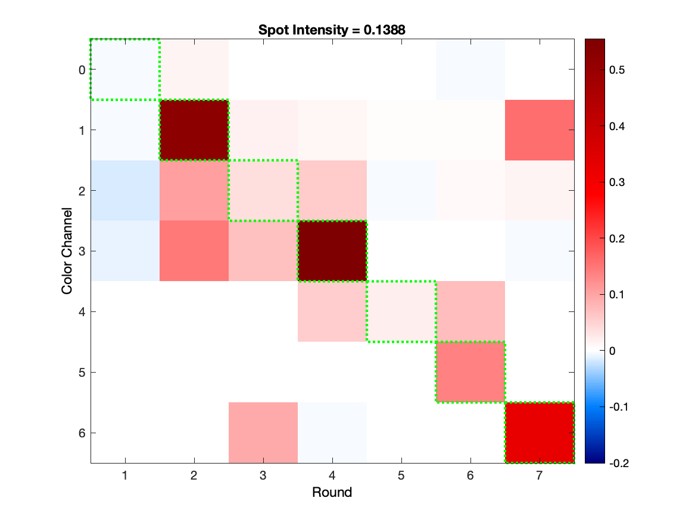
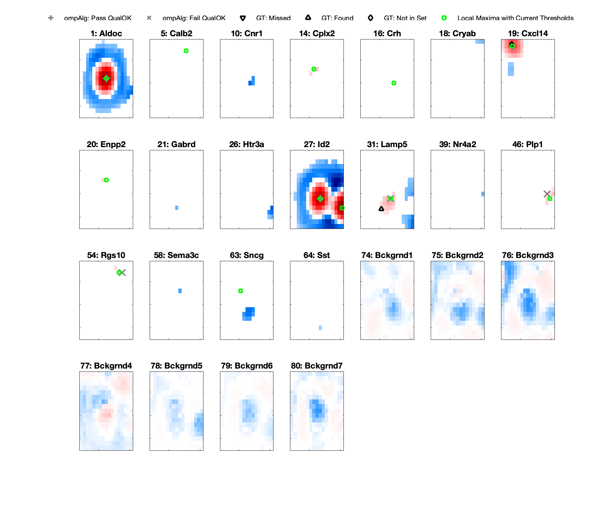
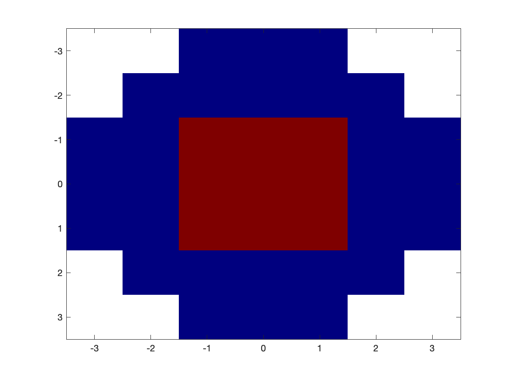
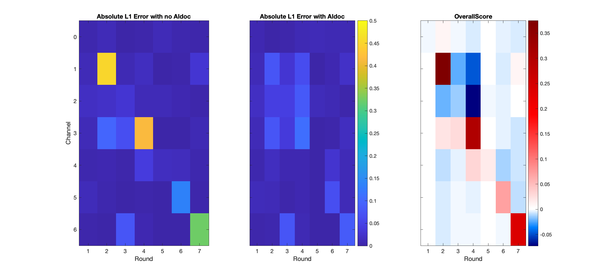
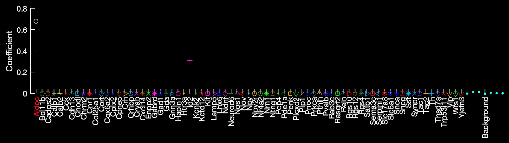
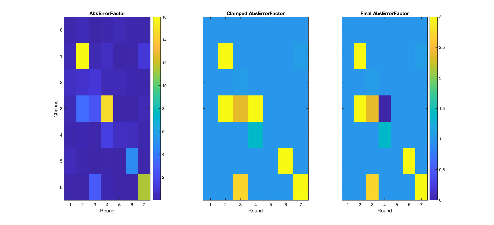
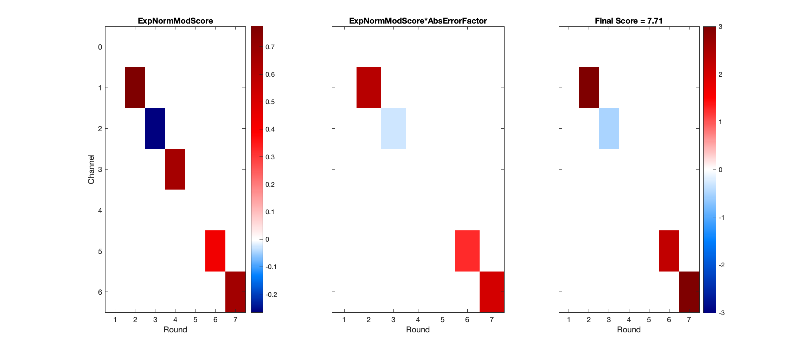

# Post Orthogonal Matching Pursuit Thresholding
The orthogonal matching pursuit (OMP) algorithm takes SpotColors [normalised by channel](https://github.com/jduffield65/iss/blob/6b5cd2336e56ad844be8fe54cc36c38f8e0deba3/@iss_Base/get_channel_norm.m) and fits the [background eigenvectors](https://github.com/jduffield65/iss/blob/6b5cd2336e56ad844be8fe54cc36c38f8e0deba3/@iss_OMP/get_background_codes.m) followed by successive genes, as long as they exceed a certain [threshold](https://github.com/jduffield65/iss/blob/e2d0e1358ce880239efee222012d0e7ac8dd30d9/%40iss_OMP_ConstantBackground_WeightDotProduct/get_omp_coefs2.m#L15-L19). However, not all the [spots found by this method](https://github.com/jduffield65/iss/blob/e2d0e1358ce880239efee222012d0e7ac8dd30d9/%40iss_OMP/iss_OMP.m#L133-L135) should be used as genes for cell calling. We must perform further thresholding on these spots. 

This thresholding is performed using three variables: [```ompSpotIntensity2```](https://github.com/jduffield65/iss/blob/e2d0e1358ce880239efee222012d0e7ac8dd30d9/%40iss_OMP/iss_OMP.m#L141-L143), [```ompNeighbNonZeros```](https://github.com/jduffield65/iss/blob/e2d0e1358ce880239efee222012d0e7ac8dd30d9/%40iss_OMP/iss_OMP.m#L160-L165) and [```ompSpotScore```](https://github.com/jduffield65/iss/blob/e2d0e1358ce880239efee222012d0e7ac8dd30d9/%40iss_OMP/iss_OMP.m#L145-L148). It is required that [all three of these are above a low threshold](https://github.com/jduffield65/iss/blob/e2d0e1358ce880239efee222012d0e7ac8dd30d9/%40iss_Base/quality_threshold.m#L53-L54) and [at least one is above a higher threshold](https://github.com/jduffield65/iss/blob/e2d0e1358ce880239efee222012d0e7ac8dd30d9/%40iss_Base/quality_threshold.m#L51-L52). Also, for spots where the gene under consideration is not the gene with the largest coefficient, [stronger thresholds must be overcome](https://github.com/jduffield65/iss/blob/e2d0e1358ce880239efee222012d0e7ac8dd30d9/%40iss_Base/quality_threshold.m#L55-L60). 

## ompSpotIntensity2
```ompSpotIntensity2``` is found using the function [```get_spot_intensity```](https://github.com/jduffield65/iss/blob/master/%40iss_Base/get_spot_intensity.m). It is median (4th largest value) of the SpotColor normalised by channel in the 7 rounds/channels indicated by the unbled code of the gene the spot was assigned to (```ompSpotCodeNo```). For example, the below (normalised) spot was assigned to Aldoc, which has an unbled code indicated by the green squares. The median of these 7 squares is round 6, channel 5 which has an intensity of 0.1388. 

<p float="left">
 
</p>

## ompNeighbNonZeros

The OMP algorithm takes each pixel in the data and fits a coefficient for each gene (most of which will be zero). From these coefficients, we can build a coefficient image for each gene as shown below (red means positive and blue means negative coefficient, while white means 0):

<p float="left">
 
</p>

From this image, the final spots are the local maxima indicated by the green circles. Clearly, some of these (Aldoc and Id2) are much more obvious than others (Plp1, Enpp2). We quantify this obviousness by counting the number of pixels surrounding the local maxima that have a non zero coefficient for that gene. Specifically, we fit the filter shown below at each local maxima and then count the positive coefficients in the red region, ```ompNeighbNonZeros(:,1)``` and positive or negative coefficients in the blue region, ```ompNeighbNonZeros(:,2)```. 

<p float="left">
 
</p>

These are then combined in a way to put more emphasis on the nearer positive coefficients: 

```NeighbNonZeros = o.ompNeighbNonZeros(:,1)*```[```o.ompNeighbNearPosNeighbMultiplier```](https://github.com/jduffield65/iss/blob/e2d0e1358ce880239efee222012d0e7ac8dd30d9/%40iss_OMP_ConstantBackground_WeightDotProduct/iss_OMP_ConstantBackground_WeightDotProduct.m#L50-L53)```+o.ompNeighbNonZeros(:,2);```

## ompSpotScore
```ompSpotScore``` is a bit more complicated but the basic idea is a score base on the difference between the fit with and without the gene under consideration. It is obtained using the function [```get_omp_score```](https://github.com/jduffield65/iss/blob/e2d0e1358ce880239efee222012d0e7ac8dd30d9/@iss_OMP_ConstantBackground_WeightDotProduct/get_omp_score.m). 

### Influence of Gene
[The first step](https://github.com/jduffield65/iss/blob/e2d0e1358ce880239efee222012d0e7ac8dd30d9/%40iss_OMP_ConstantBackground_WeightDotProduct/get_omp_score.m#L27-L42) is to get the OverallScore which is the difference between the absolute L1 error (difference between SpotColor and predicted SpotColor) when the prediction does not use the gene under consideration (we are using the same spot shown in SpotIntensity so the gene is Aldoc) and when it does. OverallScore = AbsoluteErrorNoAldoc - AbsoluteErrorWithAldoc.

<p float="left">
 
</p>

I.e. for the plot on the left, the predicted code has the Aldoc coefficient, as shown by the white circle below, set to 0 while all other coefficients remain the same. For the second plot above, all coefficients are exactly those indicated below.


<p float="left">
 
</p>

The large positive OverallScore in round 2, channel 1 indicates that Aldoc is required to explain the intensity there. On the other hand, the negative OverallScore in round 4, channel 2 indicates that the intensity there is better explained without Aldoc.


### Use specific rounds/channels for each gene
[We next](https://github.com/jduffield65/iss/blob/e2d0e1358ce880239efee222012d0e7ac8dd30d9/%40iss_OMP_ConstantBackground_WeightDotProduct/get_omp_score.m#L46-L83), modify the OverallScore to only include rounds/channels in the unbled code of Aldoc. We also only include rounds where the [gene efficiency](https://github.com/jduffield65/iss/blob/e2d0e1358ce880239efee222012d0e7ac8dd30d9/%40iss_OMP/iss_OMP.m#L248-L250) of Aldoc exceeds [```ompScore_GeneEfficiencyThresh```](https://github.com/jduffield65/iss/blob/e2d0e1358ce880239efee222012d0e7ac8dd30d9/%40iss_OMP/iss_OMP.m#L94-L96). The mask is shown on the left (gene efficiency for Aldoc fails threshold in rounds 1 and 5) and the resultant ModScore is shown in the middle:

<p float="left">
 
</p>

The third plot showing NormModScore is ModScore/AbsoluteErrorNoAldoc i.e. the second plot here divided by the first plot of the OverallScore image. We do this normalisation because we want a score independent of intensity, as the ```ompSpotIntensity2``` thresholding should deal with that. 


### Weight larger errors more and exclude overlapping rounds/channels
[The next part](https://github.com/jduffield65/iss/blob/e2d0e1358ce880239efee222012d0e7ac8dd30d9/%40iss_OMP_ConstantBackground_WeightDotProduct/get_omp_score.m#L84-L93) finds a multiplier so we get a boost for explaining rounds/channels with the largest error before we include Aldoc. This multiplier is AbsErrorFactor and is given by:

```AbsErrorFactor = AbsoluteErrorNoAldoc./prctile(AbsoluteErrorNoAldoc',```[```o.ompScore_LargeErrorPrcntileThresh```](https://github.com/jduffield65/iss/blob/e2d0e1358ce880239efee222012d0e7ac8dd30d9/%40iss_OMP/iss_OMP.m#L97-L100)```)'```

This is shown in the first plot below, and we then clamp it between 1 and [```ompScore_LargeErrorMax```](https://github.com/jduffield65/iss/blob/e2d0e1358ce880239efee222012d0e7ac8dd30d9/%40iss_OMP/iss_OMP.m#L101-L104) as indicated in the second plot.

<p float="left">
 
</p>

[We then](https://github.com/jduffield65/iss/blob/e2d0e1358ce880239efee222012d0e7ac8dd30d9/%40iss_OMP_ConstantBackground_WeightDotProduct/get_omp_score.m#L95-L177) modify this to neglect rounds that already have a positive gene in [which passes a low threshold](https://github.com/jduffield65/iss/blob/e2d0e1358ce880239efee222012d0e7ac8dd30d9/%40iss_OMP_ConstantBackground_WeightDotProduct/get_omp_score.m#L123-L139). For example, from the two coefficient images, it is clear that this Aldoc spot overalps with a Id2 spot. From the image below, showing the SpotColor with Id2 unbled code highlighted), we can see that the round 4, color channel 3 is in the unbled code of both Aldoc and Id2. Thus we set round 4, channel 3 to 0 in the Final AbsErrorFactor shown in the third plot above. The idea behind this is that each gene must have a unique contribution - it must explain something independent of what other genes are present.

<p float="left">
 
</p>


### Combine Factors
Finally, [we combine all the factors](https://github.com/jduffield65/iss/blob/e2d0e1358ce880239efee222012d0e7ac8dd30d9/%40iss_OMP_ConstantBackground_WeightDotProduct/get_omp_score.m#L184-L193). We first take the expontial turn NormModScore into an exponential through: ```ExpNormModScore = (exp(NormModScore*log(2))-1)```, as shown in the first plot below. We do this to put a lower bound on how bad a single round can be (the log(2) factor is so maximum and minimum possible ExpNormModScore have the same absolute value).

We then multiply this by the Final AbsErrorFactor to give the second plot. Lastly, we multiply this by a normalisation factor, [```nRoundsUsedNorm```](https://github.com/jduffield65/iss/blob/e2d0e1358ce880239efee222012d0e7ac8dd30d9/%40iss_OMP_ConstantBackground_WeightDotProduct/get_omp_score.m#L178-L181) so as not to penalise spots where less rounds are used i.e. here only 4 of the 7 rounds are used so ```nRoundsUsedNorm = 7/4```. We also clamp the final score between ```-o.ompScore_LargeErrorMax``` and ```o.ompScore_LargeErrorMax```. This gives the final plot, and the sum of the final plot is 7.71 which is the final score.

<p float="left">
 
</p>
